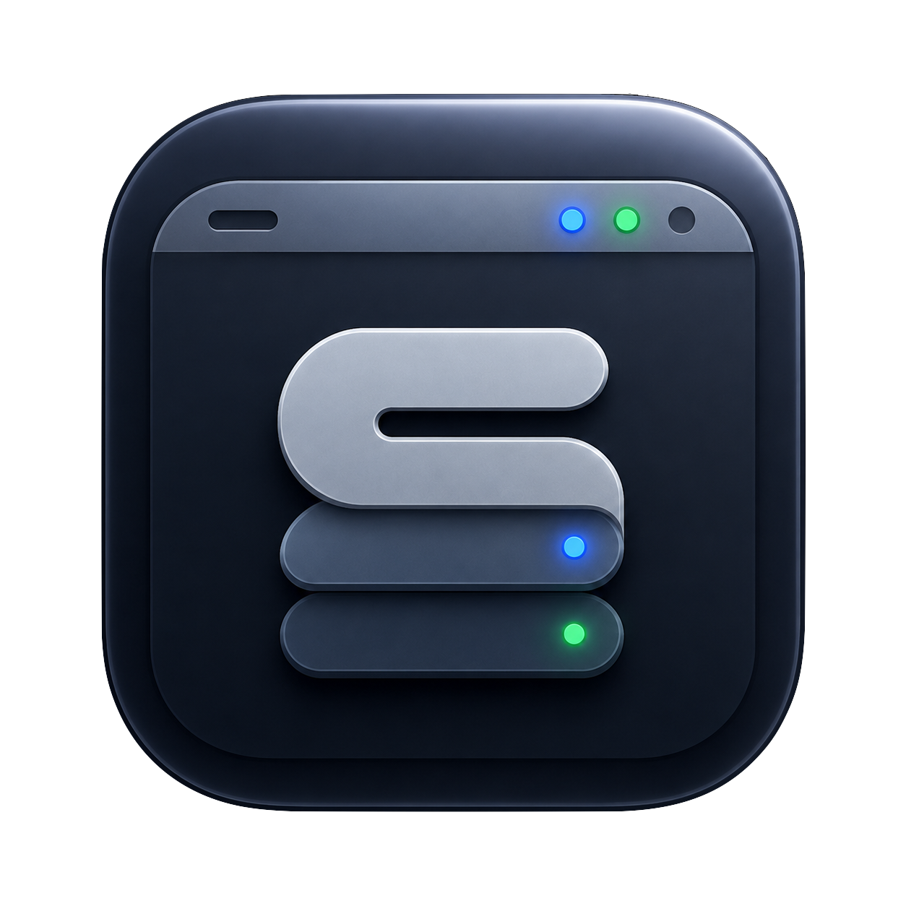

# StackLight



StackLight is a local macOS menu bar monitor for agent/context tools.

It ships with built-in monitors for:

- agentmemory
- lean-ctx
- codebase-memory-mcp
- Headroom
- Graphify
- Ponytail

The built-in catalog can be extended from the app's Settings tab. Custom tools
are stored locally at:

```text
~/Library/Application Support/StackLight/tools.json
```

## What It Monitors

Each tool can define:

- dashboard URL
- local listener ports
- dashboard start command
- dashboard stop ports
- optional metrics command
- optional presence command
- notes

StackLight displays local availability, dashboard controls, PID, CPU usage,
memory usage, and small status summaries when the tool exposes them.

Dashboard controls are intentionally scoped to dashboards: the toggle starts or
stops the configured dashboard listener and should not be used to shut down the
underlying service itself.

The monitor list also has a `Stop all dashboards` action for closing every
configured dashboard listener at once while leaving core services alone.

The Settings tab lets users add custom monitors and choose which discovered
metrics are visible in the main monitor cards.

## Privacy

StackLight is local-first. It does not send telemetry, upload metrics, or call a
hosted service. Commands run on the local Mac and dashboards are expected to bind
to `127.0.0.1` or `localhost`.

## Build

```sh
swift build
```

## Run

```sh
./script/build_and_run.sh
```

The script builds a SwiftPM executable, stages a local `.app` bundle in `dist/`,
and launches it as a menu bar app.

## Add A Tool

Open StackLight from the menu bar, go to Settings, and add a monitor.

Example values:

```text
Name: My Tool
Dashboard: http://127.0.0.1:9000
Ports: 9000
Stop ports: 9000
Start command: nohup my-tool dashboard --host 127.0.0.1 --port 9000 >/tmp/my-tool.log 2>&1 &
Metrics command: my-tool status | sed -n '1,6p'
Presence command: test -d "$HOME/.my-tool" && echo installed
```

## Icon

The repository includes `logo.png`. The development launcher converts it into
`StackLight.icns` and embeds it in the staged app bundle.

The menu bar mark is drawn natively in SwiftUI so it stays crisp at small sizes
while matching the central `S` shape of the app icon.
